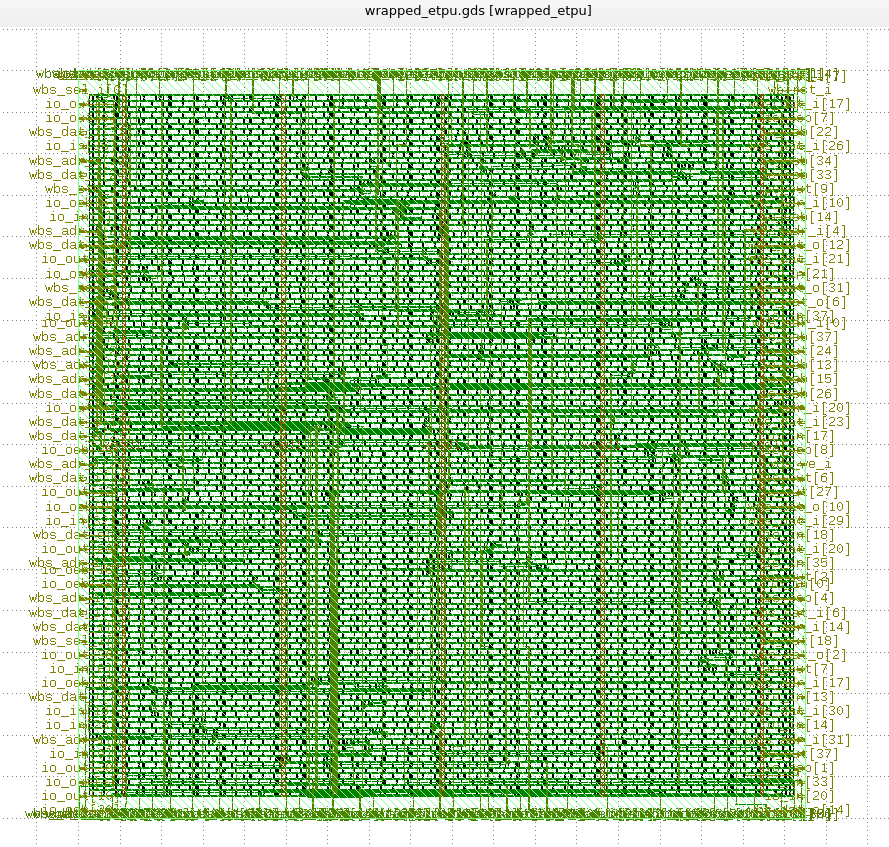
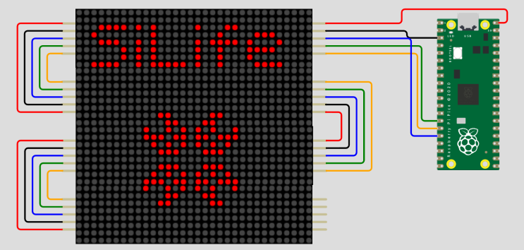
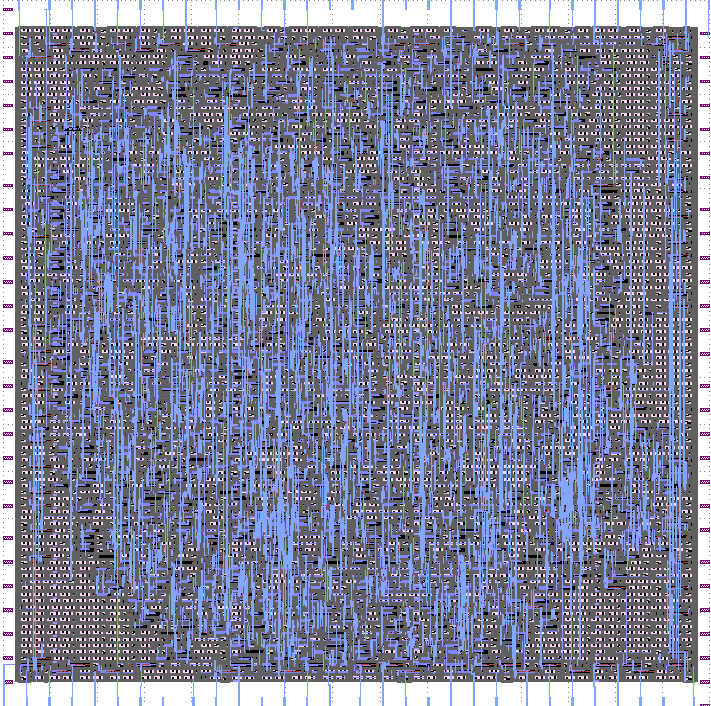

# Zero to ASIC Group submission MPW7

This ASIC was designed by members of the [Zero to ASIC course](https://zerotoasiccourse.com).

This submission was configured and built by the [multi project tools](https://github.com/mattvenn/multi_project_tools) at commit [3a2cb30fe243a183bdeedd0a54067176d002ba67](https://github.com/mattvenn/multi_project_tools/commit/3a2cb30fe243a183bdeedd0a54067176d002ba67).

The configuration files are [projects.yaml](projects.yaml) & [local.yaml](local.yaml). See the CI for how the build works.

    # clone all repos, and include support for shared OpenRAM
    ./multi_tool.py --clone-repos --clone-shared-repos --create-openlane-config --copy-gds --copy-project --openram

    # run all the tests
    ./multi_tool.py --test-all --force-delete

    # build user project wrapper submission
    cd $CARAVEL_ROOT; make user_project_wrapper

    # create docs
    ./multi_tool.py --generate-doc --annotate-image

# Project Index

## Function generator

* Author: Matt Venn
* Github: https://github.com/mattvenn/wrapped_function_generator
* commit: 701095fd880ad3bb80d6cec1d214a04e5676a65d
* Description: arbitary function generator, using shared RAM as the output data

## ibnalhaytham

* Author: Farhad Modaresi
* Github: https://github.com/sfmth/wrapped_ibnalhaytham
* commit: 0627452464db56b813a3aae8899e8339a358fac9
* Description: 32-bit RISC-V based processor

## Educational tpu

* Author: Camilo Soto
* Github: https://github.com/tucanae47/wrapped_etpu
* commit: d25b41070e74c47a00c1f264af068523c52c584a
* Description: 3x3 systolic array over wishbone bus

## SiLife

* Author: Uri Shaked
* Github: https://github.com/wokwi/wrapped_silife
* commit: aec0f0f7ad458675d961a8289d16064bf15964f6
* Description: Game of Life, in Silicon

## snn-asic

* Author: Peng Zhou
* Github: https://github.com/pengzhouzp/wrapped_snn_network
* commit: d0f3a80e664bf6327274c5fef0ace2af40db311b
* Description: asic snn accelerator with adaptive threshold neurons and recurrent connective synapses

## wrapped mbs fsk

* Author: James Rosenthal
* Github: https://github.com/jdrosent/wrapped_mbsFSK
* commit: ac3713d3220f225a6de8481bd3b72e245614e064
* Description: baseband signal engine for a backscatter uplink

