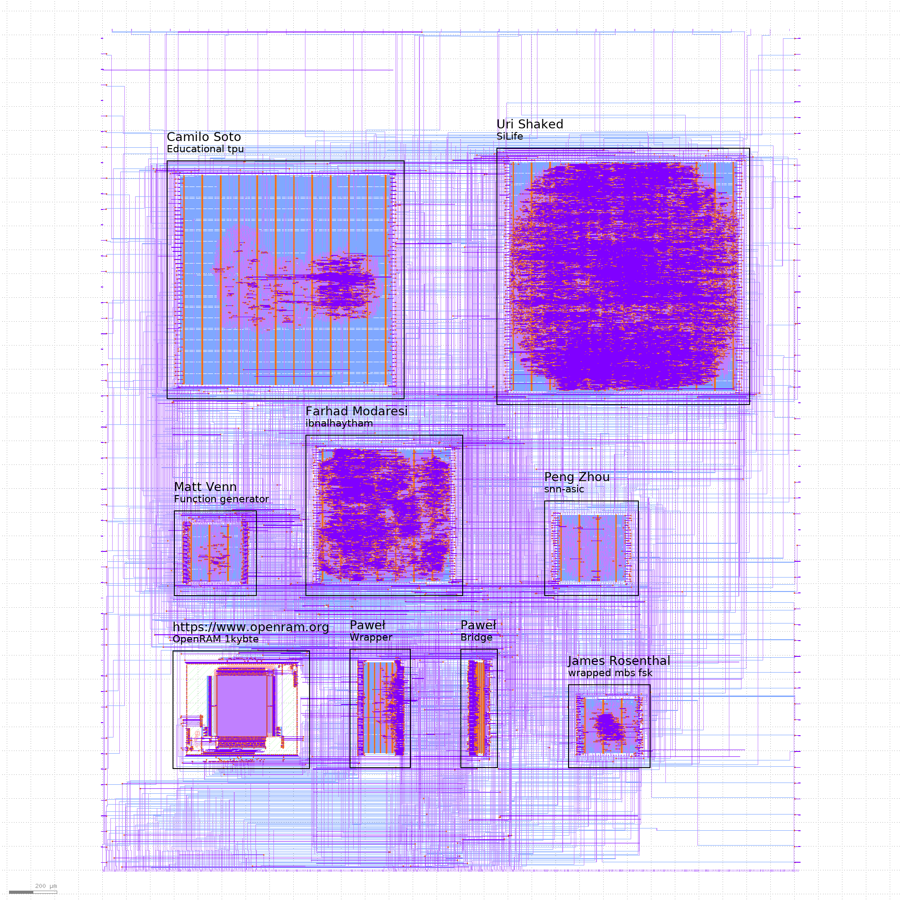

# Zero to ASIC Group submission MPW7

This ASIC was designed by members of the [Zero to ASIC course](https://zerotoasiccourse.com).

This submission was configured and built by the [multi project tools](https://github.com/mattvenn/multi_project_tools) at commit [cb6f259965e9415b4c6f6d56479070ee3aaf4006](https://github.com/mattvenn/multi_project_tools/commit/cb6f259965e9415b4c6f6d56479070ee3aaf4006).

The configuration files are [projects.yaml](projects.yaml) & [local.yaml](local.yaml). See the CI for how the build works.

    # clone all repos, and include support for shared OpenRAM
    ./multi_tool.py --clone-repos --clone-shared-repos --create-openlane-config --copy-gds --copy-project --openram

    # run all the tests
    ./multi_tool.py --test-all --force-delete

    # build user project wrapper submission
    cd $CARAVEL_ROOT; make user_project_wrapper

    # create docs
    ./multi_tool.py --generate-doc --annotate-image

# Project Index

## Function generator

* Author: Matt Venn
* Github: https://github.com/mattvenn/wrapped_function_generator
* commit: 701095fd880ad3bb80d6cec1d214a04e5676a65d
* Description: arbitary function generator, using shared RAM as the output data

## ibnalhaytham

* Author: Farhad Modaresi
* Github: https://github.com/sfmth/wrapped_ibnalhaytham
* commit: 0627452464db56b813a3aae8899e8339a358fac9
* Description: 32-bit RISC-V based processor

